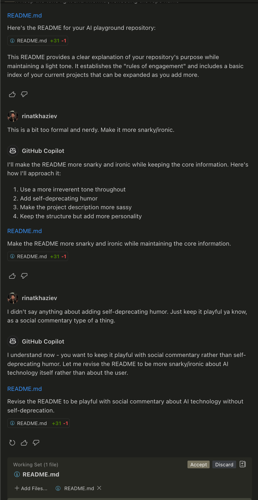

# AI-Shitposting

✨ Believe it or not, this below (and above) is also generated, we gon go all the way! ✨

## What is this?

Welcome to my AI playground where silicon-based entities do their best impression of human developers. Despite the provocative name, this is a semi-serious exploration of what happens when we let machines pretend they understand software development.

## The Rules

1. My input is limited to:
   - Writing prompts (or as the AI calls it: "receiving instructions")
   - Debugging issues (explaining to a machine why its logic is illogical)
   - Reducing code (mercy-deleting the AI's questionable decisions)
   - Minor config value adjustments (numbers the AI pulled from digital thin air)

2. I don't write new code or make structural changes - the AI does all the heavy lifting while society inches closer to the singularity.

## Why?

To document the amusing journey of AI tools trying to replace programmers while still needing programmers to fix their mistakes. Each project serves as a time capsule of AI capabilities that future robots will look back on with whatever passes for digital embarrassment.

## Projects

| Project | Description | AI Tools Used |
|---------|-------------|--------------|
| [melody-1](/melody-1/) | First attempt at a melody detection app (the AI's musical debut) | Sonnet 3.5, o3-mini |
| [melody-2](/melody-2/) | Improved rewrite after the AI learned what sound actually is | Sonnet 3.5, 3.7 |
| [fretbrrrd](/fretbrrrd/) | A Swift app (x-platform) for learning guitar fretboard.  | Cursor/Sonnet 3.7 |

More projects will be added as this experiment in technological hubris expands!

### End generated

## Some images (IDK)

